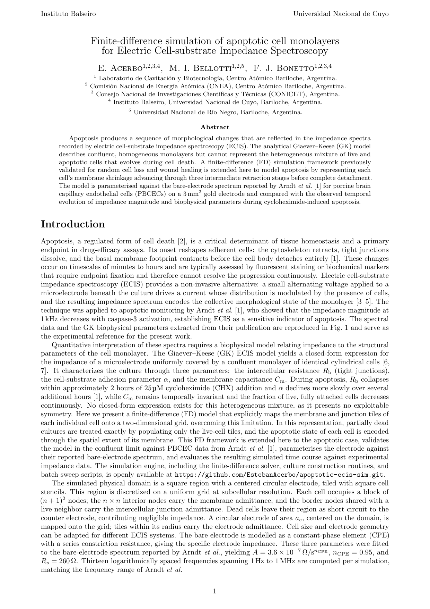

# Apoptosis ECIS Simulator

Finite-difference simulation of electric cell-substrate impedance spectroscopy (ECIS)
for cell monolayers undergoing apoptosis. Produces synthetic impedance spectra across
apoptosis stages for use in the browser-based classifier.

## Report

The full technical report (methods, results, discussion) is available here:

[](report/report_apoptosis.pdf)

## Live Classifier

**https://<your-username>.github.io/apoptotic-ecis-sim/**

Load `.dat` or `.txt` impedance files to classify the apoptosis stage.
Sample files for testing are in `classifier/samples/`.

## Simulation Dataset

Pre-computed spectra are distributed as Release assets (see the
[Releases](../../dataset) page):

| File | Cell area | Description |
|------|-----------|-------------|
| `dataset.zip` | 1700 µm² | 100 steps from confluence to bare electrode, \\each step taking 1% of random cell to start apoptosis |

### File naming convention

```
Z_apo_ac{ac}_n_{n}_Alp{alpha}_Rb{Rb}_Cm{Cm}_Per{pct}_step{step}_iter{iter}.txt
```

`step=0` = fully confluent monolayer; increasing step = more dead cells;
`step=1000` = bare electrode (1700 µm² dataset only).

## Simulation Engine

### Dependencies

```bash
pip install numpy scipy matplotlib tqdm joblib pypardiso
```

`pypardiso` (Intel MKL PARDISO) is optional; falls back to `scipy` automatically.

### Single simulation

```bash
cd simulation
python main.py
```

Edit the parameter block at the top of `main.py` before running.

### Parallel batch sweep

```bash
cd simulation
python Runner.py
```

**Critical:** `N_JOBS × MKL_THREADS` must equal your physical core count.
Both variables are set at the top of `Runner.py`, before any numpy import.

Output files land in `Simulations/` (not tracked by git).

## License

MIT